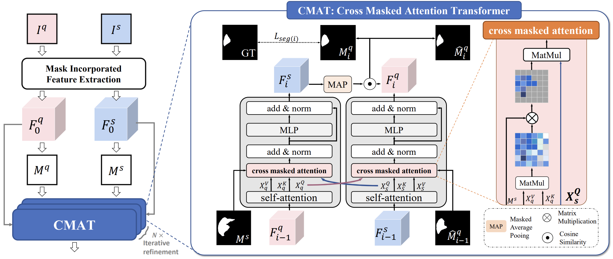
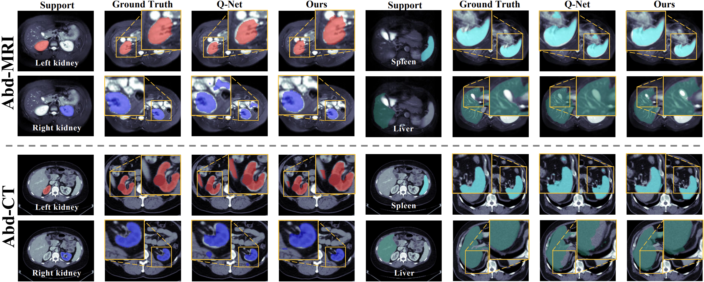

# Masked Attention Transformer (CAT-Net)
This is the official code for our MICCAI 2023 paper:

> [Few Shot Medical Image Segmentation with Cross Attention Transformer](https://arxiv.org/abs/2303.13867) <br>
> Yi Lin*, Yufan Chen*, Kwang-Ting Cheng, Hao Chen

## Highlights
<p align="justify">
In this work, we propose a novel framework for few-shot medical image segmentation, termed CAT-Net, based on cross masked attention Transformer. Our proposed network mines the correlations between the support image and query image, limiting them to focus only on useful foreground information and boosting the representation capacity of both the support prototype and query features. We further design an iterative refinement framework that refines the query image segmentation iteratively and promotes the support feature in turn.

[comment]: <> ()

<div align="center">
Left: Overview of the CAT-NET; Right: The architecture of CMAT module.
</div> 

### Using the code
Please clone the following repositories:
```
git clone https://github.com/hust-linyi/CAT-Net
```

### Requirement
```
pip install -r requirements.txt
```

### Data preparation
#### Download
1. **Abdominal CT**  [Synapse Multi-atlas Abdominal Segmentation dataset](https://www.synapse.org/#!Synapse:syn3193805/wiki/217789)
2. **Abdominal MRI**  [Combined Healthy Abdominal Organ Segmentation dataset](https://chaos.grand-challenge.org/)  
3. **Cardiac MRI** [Multi-sequence Cardiac MRI Segmentation dataset (bSSFP fold)](http://www.sdspeople.fudan.edu.cn/zhuangxiahai/0/mscmrseg/) 

#### Pre-processing
Please refer to [Ouyang et al.](https://github.com/cheng-01037/Self-supervised-Fewshot-Medical-Image-Segmentation.git)

### Training
1. Download pre-trained [ResNet-101 weights](https://download.pytorch.org/models/resnet101-63fe2227.pth) and put into your own backbone folder.
2. Run the following command for Abdominal CT/MRI:
```
sh ./exps/train_Abd.sh
```
Run the following command for Cardiac MRI:
```
sh ./exps/train_CMR.sh
```

### Inference
Run `./exp/validation.sh`

### Visualization
[comment]: <> ()

<div align="center">
Qualitative results of our method on Abd-CT and Abd-MRI.
</div> 

## Citation
Please cite the paper if you use the code.
```bibtex
@article{lin2023few,
  title={Few Shot Medical Image Segmentation with Cross Attention Transformer},
  author={Lin, Yi and Chen, Yufan and Cheng, Kwang-Ting and Chen, Hao},
  journal={arXiv preprint arXiv:2303.13867},
  year={2023}}
```

## Acknowledgment 
This code is based on [Q-Net](https://github.com/zjlab-ammi/q-net), [PFENet](https://github.com/dvlab-research/PFENet), thanks for their excellent work!
